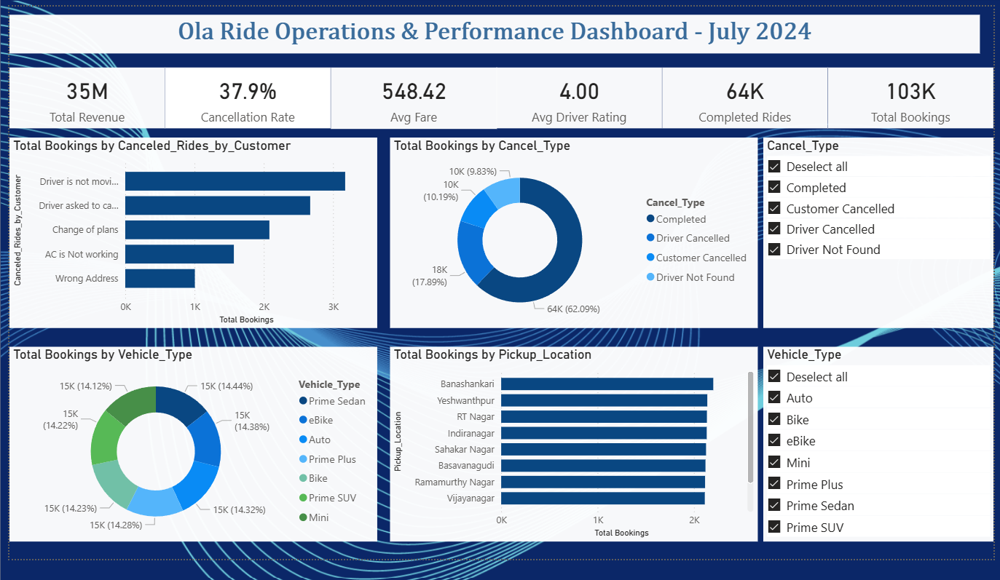

# 🚗 Ola Ride Operations & Performance Dashboard
### July 2024 · Data Analyst Internship Project


---

## 📌 Problem Statement

Ola's July 2024 data revealed a **37.9% ride cancellation rate** — nearly 4 in 10 bookings never completed. This project investigated the *who, why, and where* behind cancellations, and translated findings into concrete operational strategies to recover lost revenue and improve customer experience.

---

## 📊 Dashboard Preview



---

## 📈 Key Metrics at a Glance

| Metric | Value |
|--------|-------|
| 💰 Total Revenue | ₹35M |
| 🚫 Cancellation Rate | 37.9% |
| 🧾 Avg Fare | ₹548.42 |
| ⭐ Avg Driver Rating | 4.00 |
| ✅ Completed Rides | 64K |
| 📦 Total Bookings | 103K |

---

## 🔍 Key Insights

### 1. Driver Behaviour is the #1 Cancellation Driver
- **62.09%** of bookings completed — over a third failed to reach the customer
- Top customer-reported cancellation reasons:
  - *"Driver is not moving towards pickup"* — highest volume (~3K bookings)
  - *"Driver asked to cancel"*
  - *"Change of plans"*
  - *"AC is not working"*
  - *"Wrong address"*
- The top two reasons are **driver-side behavioural issues**, not customer preference — pointing to an accountability gap

### 2. Fleet is Balanced But Completion Rates Vary
- 7 vehicle types — each holding ~14–14.4% of total bookings (near-equal distribution)
- Types: Prime Sedan · eBike · Auto · Prime Plus · Bike · Prime SUV · Mini
- Despite balanced supply, certain vehicle types likely carry higher cancellation rates — a signal for targeted driver incentives

### 3. Demand is Geographically Concentrated
- **Banashankari** leads all pickup zones by total bookings
- Top zones: Yeshwanthpur · RT Nagar · Indiranagar · Sanakar Nagar · Basavanagudi · Ramamurthy Nagar · Vijayanagar
- Concentrating driver supply in these 3–4 zones can deliver outsized improvement in completion rates

---

## 💡 Recommendations

| Priority | Action | Expected Impact |
|----------|--------|----------------|
| 🔴 High | Driver completion-rate incentive program | Directly reduce the 37.9% cancellation rate |
| 🔴 High | Predictive driver positioning in Banashankari, Yeshwanthpur, RT Nagar | Reduce supply gaps in peak zones |
| 🟡 Medium | Re-evaluate driver penalty structures | Reduce "driver asked to cancel" behaviour |
| 🟡 Medium | Investigate AC complaint pattern across vehicle types | Reduce customer-side cancellations |
| 🟢 Low | Push premium segments (Prime Sedan, Prime Plus) in high-demand zones | Increase avg fare above ₹548 |

---

## 🛠️ Process

```
Raw Data (.csv)
    ↓
Python EDA (Pandas, NumPy, Matplotlib)
    → Data cleaning & validation
    → Cancellation pattern breakdown by type & reason
    → Vehicle-type and location-level segmentation
    ↓
Power BI Dashboard
    → KPI cards: Revenue · Cancellation % · Avg Fare · Rating · Completions · Total Bookings
    → Bar chart: Cancellations by customer-reported reason
    → Donut chart: Booking share by cancel type
    → Donut chart: Fleet distribution by vehicle type
    → Bar chart: Total bookings by pickup location
    → Interactive filters: Cancel type · Vehicle type · Weekday
```

---

## 📁 Files

```
📁 01-ola-ride-operations/
├── README.md
├── ola_final.pbix
└── 📁 screenshots/
    └── ola_dashboard.png
```

---

[← Back to Portfolio](../README.md)
