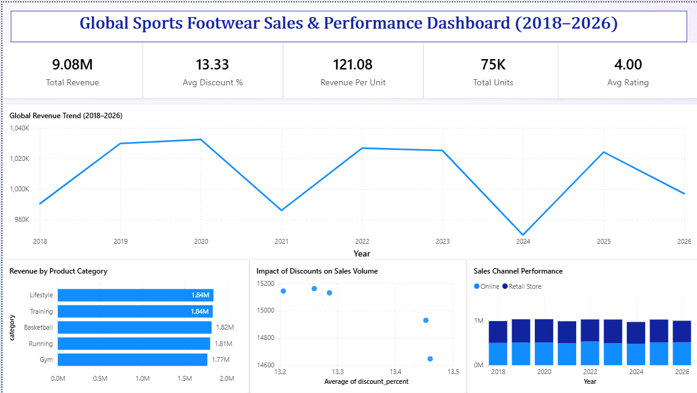

# 👟 Global Sports Footwear Sales & Performance Dashboard
### 2018–2026 · 30,000 Orders · Consumer Behavior Analysis


---

## 📌 Problem Statement

The global sports footwear market has been generating stable revenue for years — but stability is not growth. This project analyzed 8 years of sales data to answer: **Which categories actually drive revenue? What does discounting really do to the bottom line? And where are the untapped growth opportunities?**

---

## 📊 Dashboard Preview



---

## 📈 Key Metrics at a Glance

| Metric | Value |
|--------|-------|
| 💰 Total Revenue | $9.08M |
| 📦 Total Units Sold | 75K |
| 💵 Revenue Per Unit | $121.08 |
| 🏷️ Avg Discount % | 13.33% |
| ⭐ Avg Rating | 4.00 |

---

## 🔍 Key Insights

### 1. Revenue Trend Shows a Volatile 8-Year Story
- Revenue ranged between **~$980K–$1.02M annually** from 2018–2026
- Strong peak in **2020** (~$1.02M), followed by a sharp dip in **2021** (~$990K)
- Recovery through 2022–2023, then **another significant drop in 2024** to the lowest point in the dataset
- 2025–2026 show partial recovery but remain below peak levels
- The W-shaped trend signals **external sensitivity** — market shocks in 2021 and 2024 hit this segment hard

### 2. Categories Are Surprisingly Equal — Lifestyle and Training Lead
- Revenue by product category (top 5):
  - **Lifestyle: $1.84M** 🥇
  - **Training: $1.84M** 🥇 (tied)
  - Basketball: $1.82M
  - Running: $1.81M
  - Gym: $1.77M
- Near-equal revenue distribution suggests **no single category dominates** — a diversified but undifferentiated portfolio
- Opportunity to build clear category heroes rather than spreading investment evenly

### 3. Discounts Have Minimal Impact on Sales Volume
- Scatter plot of discount % vs. units sold shows **near-zero correlation**
- Units sold holds flat at ~14,600–15,200 regardless of discount level (13.2%–13.5% range tested)
- Insight: **Current discount band is too narrow to move the needle** — either go deeper or reallocate promotion budget

### 4. Online and Retail Store Performance Is Neck-and-Neck
- Both channels tracked year-by-year from 2018–2026
- Neither channel consistently dominates — both hover around $1M/year
- Online channel has **higher scalability potential** with lower marginal cost per sale
- No clear acceleration in online growth despite broader e-commerce trends — suggests underinvestment in digital

---

## 💡 Recommendations

| Priority | Action | Expected Impact |
|----------|--------|----------------|
| 🔴 High | Accelerate online channel investment — it's not growing despite market tailwinds | Unlock scalable revenue growth |
| 🔴 High | Redesign discount strategy — current 13% band isn't moving volume | Better margin-to-volume tradeoff |
| 🟡 Medium | Differentiate Lifestyle & Training as flagship categories | Stronger brand positioning |
| 🟡 Medium | Investigate 2024 revenue dip — operational or market-driven? | Risk mitigation |
| 🟢 Low | Test deeper discounts (20%+) in one category to measure real elasticity | Data-backed pricing strategy |

---

## 🛠️ Process

```
Raw Data (.csv — 30,000 orders)
    ↓
Python EDA (Pandas, NumPy, Matplotlib)
    → Data cleaning & type validation
    → Revenue trend analysis (2018–2026)
    → Category-level revenue breakdown
    → Discount vs. volume correlation analysis
    → Channel performance comparison
    ↓
Power BI Dashboard
    → KPI cards: Total Revenue · Units · Revenue/Unit · Avg Discount · Avg Rating
    → Line chart: Global Revenue Trend (2018–2026)
    → Horizontal bar: Revenue by Product Category
    → Scatter plot: Impact of Discounts on Sales Volume
    → Grouped bar: Online vs Retail Store performance by year
```

---

## 📁 Files

```
📁 02-footwear-analysis/
├── README.md
├── footwear_dashboard.pbix
└── 📁 screenshots/
    └── footwear_dashboard.png
```

---

[← Back to Portfolio](../README.md)
