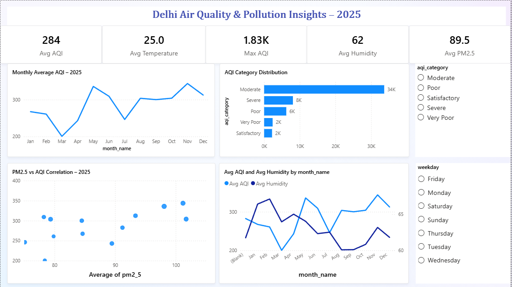

# 🌫️ Delhi Air Quality & Pollution Insights
### Full Year 2025 · 52,560 Hourly Records


---

## 📌 Problem Statement

Delhi's air quality crisis is well-known — but the policy response remains largely reactive. This project analyzed **52,560 hours** of environmental data to decode seasonal pollution patterns, identify primary pollutants, and provide evidence for **proactive, time-targeted interventions** before health damage occurs.

---

## 📊 Dashboard Preview



---

## 📈 Key Metrics at a Glance

| Metric | Value |
|--------|-------|
| 📊 Avg AQI | 284 |
| 🌡️ Avg Temperature | 25.0°C |
| 🔴 Max AQI | 1.83K |
| 💧 Avg Humidity | 62 |
| 🌫️ Avg PM2.5 | 89.5 |

---

## 🔍 Key Insights

### 1. AQI Follows a Predictable Seasonal Curve
- AQI dips to its lowest around **March** (~175) — the cleanest month of the year
- Climbs sharply through summer, peaking around **May–June** (~325)
- Drops during monsoon (July–September) as rain clears particulates
- **Spikes again in November** post-monsoon — the year's most critical danger window
- This pattern is highly consistent and **foreseeable**, making reactive policy inexcusable

### 2. "Moderate" Dominates — But Severe Days Are Many
- AQI Category distribution from 52K records:
  - **Moderate: 34K hours** — the dominant category
  - Severe: 8K hours
  - Poor: 6K hours
  - Very Poor: 2K hours
  - Satisfactory: 2K hours
- Delhi spends very little time in truly clean air — even "Moderate" carries health risk with sustained exposure

### 3. PM2.5 is the Primary Pollutant Driver
- Strong positive correlation confirmed between **PM2.5 concentration and overall AQI**
- PM2.5 values cluster between 80–110 at moderate AQI levels, spiking beyond 350+ during severe events
- Scatter analysis shows a clear linear relationship — PM2.5 is the most reliable AQI predictor

### 4. Humidity and AQI Move in Opposite Directions
- When monsoon brings high humidity (June–September), AQI drops
- Post-monsoon as humidity falls, AQI climbs sharply (October–November)
- This inverse relationship enables **early warning modeling** using humidity forecasts

### 5. Temperature Alone Does Not Drive Pollution
- Avg temperature held steady at ~25°C with minimal monthly variation
- Temperature is **not a reliable predictor** of AQI spikes — multi-variable analysis (PM2.5, humidity, wind) is essential

---

## 💡 Recommendations

| # | Intervention | Timing |
|---|-------------|--------|
| 01 | Pre-winter pollution controls (traffic, industry) | September onwards |
| 02 | Intensify stubble burning monitoring & enforcement | October–November |
| 03 | Dust suppression at construction sites | April–May |
| 04 | Integrate humidity + wind into AQI early-warning models | Year-round |
| 05 | Trigger public health advisories at AQI > 200 | Automated, real-time |

---

## 🛠️ Process

```
Raw Hourly Data (.csv — 52,560 records)
    ↓
Python EDA (Pandas, NumPy, Matplotlib)
    → Cleaning & missing value handling
    → Monthly AQI aggregation & trend analysis
    → PM2.5 vs AQI correlation analysis
    → AQI category distribution
    → Humidity vs AQI relationship
    ↓
Power BI Dashboard
    → KPI cards: Avg AQI · Avg Temp · Max AQI · Avg Humidity · Avg PM2.5
    → Line chart: Monthly Average AQI – 2025
    → Bar chart: AQI Category Distribution (hours in each band)
    → Scatter plot: PM2.5 vs AQI Correlation
    → Dual-axis line: Avg AQI vs Avg Humidity by month
    → Interactive filters: AQI Category · Day of Week
```

---

## 📁 Files

```
📁 03-delhi-aqi-weather/
├── README.md
├── Delhi_AQI_and_Weather_dashboard.pbix
└── 📁 screenshots/
    └── delhi_aqi_dashboard.png
```

---

[← Back to Portfolio](../README.md)
